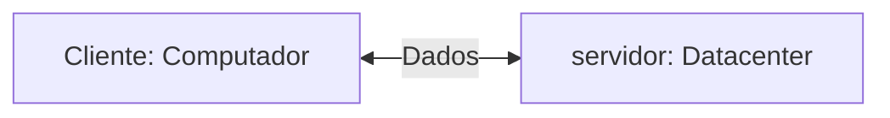
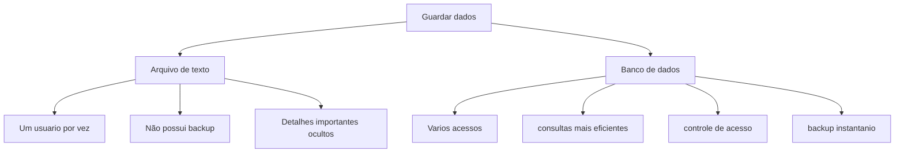
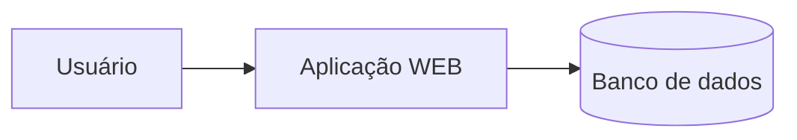

## Servidor de desenvolvimento
sera uma interface de desenvolvimento, utilizada para projetar aplicações e bando de dados.


--- 
## Servidor de Arquivos Educacional
É um servidor para armazenar aquivos e facilitar na hora de realizar a tranferência.

> O endereço para acesso ao servidor de arquivos é: `\\10.87.36.10`.

---
## Servidor Pessoal
O moda será a interface de acesso ao meu servidor de desenvolvimento
>O acesso, será realizado via `SSH`

>Credenciais de acesso: `IP: 192.168.10.100`, Username: `root` e a Porta: `2222`, Numero da chamada: `26`

### Para alterar a senha de acesso do linux
```bash
passwd
```
### Para visualiza as informações do meu servidor:
```bash
htop
```
### Para visualizar as informações do sistema (versão do OS, kernel, tempo ligado, memória RAM e outros detalhes)
```bash
neofetch
```

---
A utilizaçao de um servidor de desenvolvimento simula um ambiente de trabalho

- Deploy de projetos,
- Aplicação de banco de dados,
- Experiência real de mercado.


## Banco de dados
Antigamente, os dados eram salvos em arquivos/planilhas.


---
>mas afinal, onde entra o banco de dados em aplicações web🤔?



## SGBD
Sistema Gerenciador de Banco de Dados.

>função: Gerenciar, Controlar e permitir consultas nos nossos bancos de dados

```mermaid
graph TD
A[SGBD- PostgreSQL] -->B[(banco de dados)]
A --> C[Armazena usuarios]
A --> D[Realiza consultas]
A --> E[ controla acessos]