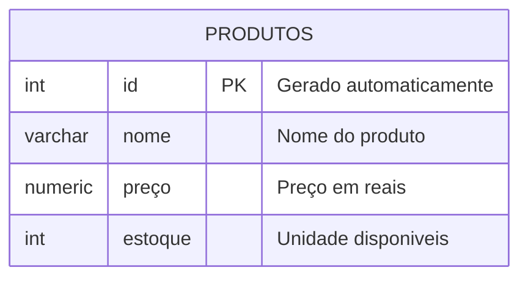

# Aula 04

Comando para remover um banco de dados:
```sql
DROP DATABASE lojamax;
```
---
O objetivo é criat uma loja para aprender os principais comando SQL.


---
# Comandos da tabela sql

Para criar a tabela, utilizamos os comandos abaixo:
```sql
CREATE TABLE produtos (
    id INT GENERATED ALWAYS AS IDENTITY PRIMARY KEY, 
    nome VARCHAR(50) NOT NULL,
    preco NUMERIC(10,2) NOT NULL,
    estoque INT NOT NULL DEFAULT 0
);
```

Para inserir dados na tabela utilizei os comandos abaixo:
```sql
INSERT INTO produtos(nome,preco,estoque)
VALUES('iphone 17', '10000.00','15');
```
Para apagar uma tabela, utilizamos o comando:
```sql
DROP TABLE produtos;
```
---

Quando eu quiser adicionar mais de um valor de uma so vez, invez de fazer um por 1 Faça o seguinte comando:
```sql
INSERT INTO maiorescidades (nome, populacao)
VALUES
('Notebook Gamer', '2000.00','10'),
('Cadeira Gamer', '1000.00', '5');
```
> Essa forma facilita a inserção de muiltiplos valores na tabela.

---

Quando eu quero verificar minha tabela:
```sql
SELECT * FROM maioresCidades
```