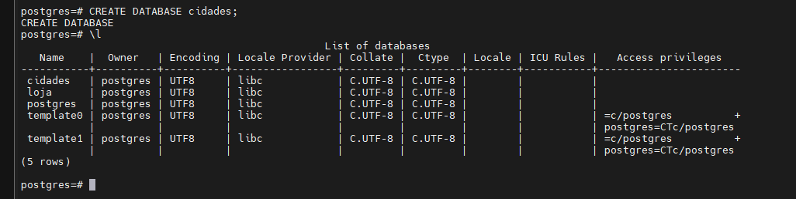

# Print da atividade
Criando o banco de dados chamado Cidades


---

Logo depois puxei o banco de dados para o vscode


---
Criando a tabela utilizei o seguinte comando:
```sql
CREATE TABLE maioresCidades (
id INT GENERATED ALWAYS AS IDENTITY PRIMARY KEY,
nome VARCHAR(50) NOT NULL,
 populacao INT NOT NULL
```
assim foi criado a tabela maioresCidades

---

Logo depois adicionei os valore com o seguinte comando:
```sql
INSERT INTO maiorescidades (nome, populacao)
VALUES
('Tóquio', 37000000),
('Délhi', 34000000),
('Xangai', 30000000),
('Daca', 24000000),
('São Paulo', 23000000);
```
--- 

Depois verifiquei como ficou a tabela utilizando o comando:
```sql
SELECT * FROM maioresCidades
```
