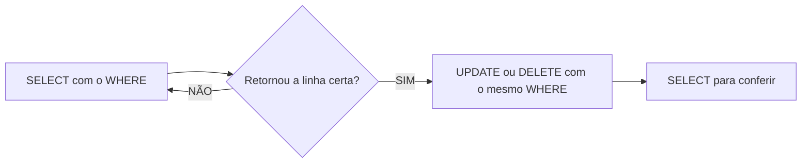

## Aula 05
Para filtras colunas, utilizamos o comando:
```sql
SELECT nome,preco FROM produtos;
```
Para filtro de registro utilizamos o comando:
```sql
SELECT * FROM produtos WHERE estoque < 10;
```

Para ordenar od dados:
```sql
SELECT nome,preco FROM produtos
ORDER BY preco DESC;
```

---

**UPDATE**: Update ou Delete sem  `WHERE` atinge TODAS as linhas! Não existe Ctrl+z :(

Fluxo seguro (sempre):


--- 

Para atualizar algum valor utilizamos o comando:
```sql
UPDATE produtos 
SET preco= 150
WHERE id =4;
```
--- 

Tambemé possivel realizar calculos:
```sql
UPDATE produtos SET estoque = estoque - 3
WHERE id = 2;
```
**DELETE**:
Para apagar registros?
```sql
DELETE FROM produtos 
WHERE name = 'Notebook Gamer';