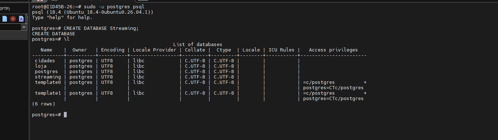
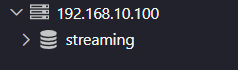
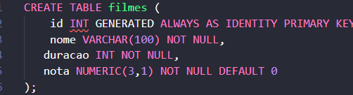
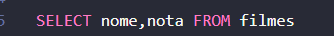
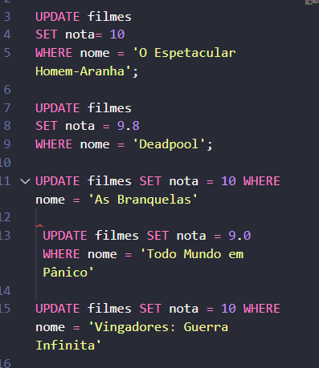
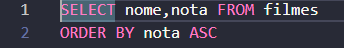
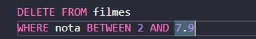

# Prints da atividades
Abaixo segue o print das atividades junto de comentarios para melhor entendimento.

--- 
## Criar um banco de dados de Streaming de Filmes e Séries 

na imagem acima criei o banco de dados chamado Streaming utilizando o comando:
```sql
CREATE DATABASE Streaming;
```
--- 
## Realizar o acesso via VsCode 
No print a baixo realizei o acesso via vscode colocando as informações do meu BCD:


---
## Criação da tabela
A baixo segue o print dos comandos utilizados para criar a tabela:


---
## Consulta
Apos ter adicionados os valores, consultei somente nome e nota com o seguinte comando:



---
## Atualização
abaixo atualualizei nota de 5 filmes com a minha opnião com o seguinte codigo:



## SSD cheio
filtrei as menores notas:




Meu armazenamento fico cheio, ent tenho que apagar os 5 filmes com avaliação mais baixa De 0 ate 7.9.
Com o seguinte comando:
