# Parte A
### A1. Liste o nome e o preço de todos os produtos da categoria Monitores.

Utilizei um filtro de pesquisa para buscar na tabelah produtos o nome e preço somente da categoria Monitores:

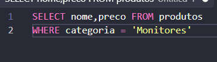

### A2. Liste todos os produtos com estoque menor que 5 unidades, mostrando nome, categoria e estoque.

Pra isso se usa um filtro que busca pelo estoque menor que 5,sendo assim são 118 itens menores que 5, tambem mostrando quem são e sua categoria.

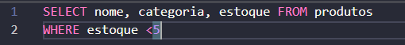

### A3. Liste os 10 produtos mais caros da loja (nome e preço), do mais caro para o mais barato.

Outri filtro, mas dessa vez é para verificar todos os produtos mais caros da loja com o limit de 10 do mais caro pro mais barato:

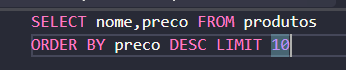

sendo assim, mostrando todos os 10 itens mais caro do maior pro menor.

### A4. Liste os produtos da marca Logitech, ordenados por preço crescente.

Filtrar dos produtos a marca logitech, de uma ordem do menor pro menor.

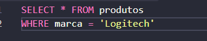

sendo assim são 23 itens desta mesma marca, mostrando todas as informações dos produtos.

### A5. Liste os produtos com preço entre R$ 100,00 e R$ 500,00, mostrando nome e preço.

Pra isso usa um Comando chamado BETWEEN, que ele serve pra filtrar entre 2 valores da faixa em que eu escolher, sendo assim mostrando 327 produtos da faixa de preço de 100 e 500 reais.

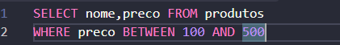

assim mostrando somente o nome e o preço.

---

# Parte B

### B1. Quantos produtos existem cadastrados na loja? Dê ao resultado o nome total_de_produtos.

Para vermos quantos produtos existem cadastrados na loja, caso tenhoa muitos produtos, invez de puxar a tabela toda, usei count, assim conta todos os valores da tabela, retornando um resultado de 1000 itens:

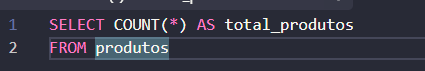

Total de produtos:

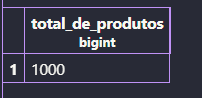

### B2. Quantos produtos estão com estoque abaixo de 10 unidades? Nomeie a coluna como produtos_em_falta.
Contei quantos produtos com o estoque abaixo de 10, retornando 265 produtos, seria bom fazer um reestoque:

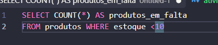

### B3. Qual o maior e o menor preço da loja? Traga os dois na mesma consulta, com os nomes maior_preco e menor_preco.
O maior preco é: 20386.90 e o menor é 22.90, pra fazer essa consulta utilizei min e max:

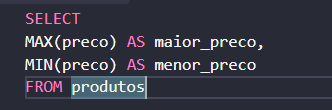

tudo em uma unica consulta.

### B4. Qual o preço médio dos produtos da categoria Notebooks, arredondado para 2 casas decimais?
O preço medio dos produtos da categoria Notebooks, arredondado pra 2 casas decimais é de 64578.38, Pra fazer isso fiz a soma dos produtos com AVG e o ROUND pra formatar pra 2 casas decimais, depois fiz uma busca expecifica, se n fazria a media de todos os produtos, e não queremos isso, queremos um em exato. Sendo assim:

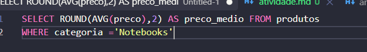

Preco_medio

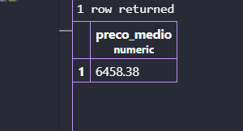

### B5. Quantas peças a loja tem no total, somando o estoque de todos os produtos? Nomeie como total_de_pecas.
Existem 37891 peças, somei todos os itens do estoque:

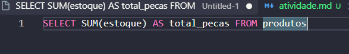

---

# Parte C

### C1. Monte um painel resumo em uma única consulta, retornando de uma vez: quantidade de produtos, preço médio (2 casas decimais), maior preço, menor preço e total de peças em estoque. Todas as colunas devem ter nomes compreensíveis para o gerente.
Tudo em uma unica query:

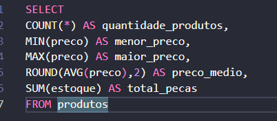

Resultados:

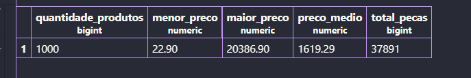

Assim de uma forma façil de entender, objetiva e organizada.

### C2. O valor imobilizado de um produto não está gravado na tabela: ele precisa ser calculado (preço x estoque). Crie a coluna calculada valor_em_estoque e mostre os 5 produtos com maior valor imobilizado, exibindo nome, preço, estoque e o valor calculado.
Indiquei oque queria ver na tabela que seria nome,estoque e preco E valor_em_estoque, fiz um (preco * estoque) indiquei que o nome seria valor_em_estoque e buxei na tabela em forma decrecente e limite de 5: 

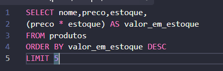

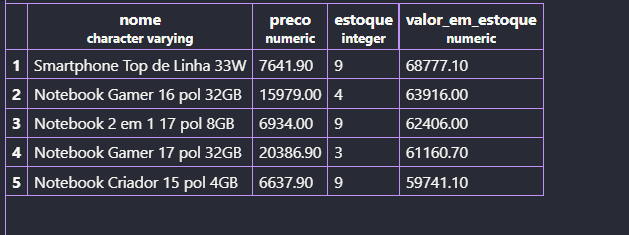

### C3. Compare o resultado de C2 com o produto mais caro que apareceu em A3. É o mesmo item? Escreva duas linhas explicando o que essa comparação revela sobre o estoque da loja.

Não são o mesmo item. O produto mais caro da loja é o Notebook Gamer 17 pol 32GB, com preço de R$ 20.386,90, mas ele não possui o maior valor imobilizado porque há apenas 3 unidades em estoque.
Isso mostra que o preço individual de um produto não determina sozinho quanto dinheiro está parado no estoque, pois produtos mais baratos em grandes quantidades podem representar um valor imobilizado maior.