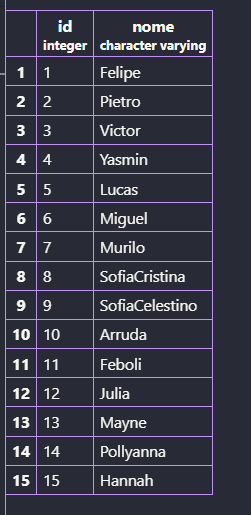
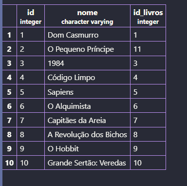

# Biblioteca: Consultas SQL

## 1) Todos os dados de cada tabela

Mostre todos os dados de cada tabela (uma consulta para cada).

Consulta da tabela de alunos:


O codigo usado para inserir os alunos foi:
```sql
INSERT INTO alunos(nome) VALUES
('Felipe'),
('Pietro'),
('Victor'),
('Yasmin'),
('Lucas'),
('Miguel'),
('Murilo'),
('SofiaCristina'),
('SofiaCelestino'),
('Arruda'),
('Feboli'),
('Julia'),
('Mayne'),
('Pollyanna'),
('Hannah');
```

Consulta da tabela dos livros:


O codigo usado para inserir os valores da tabela:
```sql
INSERT INTO emprestimos(nome,id_livros) VALUES
('Dom Casmurro', 1),
('O Pequeno Príncipe', 11),
('1984', 3),
('Código Limpo', 4),
('Sapiens', 5),
('O Alquimista', 6),
('Capitães da Areia', 7),
('A Revolução dos Bichos', 8),
('O Hobbit', 9),
('Grande Sertão: Veredas', 10);
```

---

## 2) INNER JOIN: aluno e o livro que pegou

Usando `INNER JOIN`, mostre o nome do aluno e o livro que ele pegou.

```sql
SELECT alunos.nome,emprestimos.nome
FROM alunos
INNER JOIN emprestimos ON alunos.id = emprestimos.id_livros
```

Resultando em:


**Responda:** quais alunos NÃO apareceram? Por quê?

> Os alunos que nunca pegaram nenhum livro: Julia, Pietro, Hanna, Mayne e Pollyana, O `INNER JOIN` só retorna as linhas que tem relação nas duas tabelas. Se o aluno não tem nenhum registro em `emprestimos`, ele não ira aparecer na consulta.


---

## 3) LEFT JOIN: todos os alunos e o livro de cada um

Usando `LEFT JOIN`, mostre TODOS os alunos e o livro de cada um.

```sql
SELECT alunos.nome,emprestimos.nome
FROM alunos
LEFT JOIN emprestimos ON emprestimos.id_livros = alunos.id
```

**Responda:** o que apareceu na coluna livro para quem não pegou nenhum livro?

> Apareceu null, pq esses alunos não pegaram nenhum livro

---

## 4) Alunos que NUNCA pegaram livro

A bibliotecária quer saber quem NUNCA pegou livro. Escreva a consulta que mostra só esses alunos.

```sql
SELECT alunos.nome,emprestimos.nome
FROM alunos
LEFT JOIN emprestimos ON emprestimos.id_livros = alunos.id
WHERE emprestimos.id IS NULL;
```
>sendo assim fazendo um filtro para saber quem nunca pegou livro
---

## 5) Registrar empréstimo para o aluno 50

Tente registrar um empréstimo para o aluno 50:

```sql
INSERT INTO emprestimos (livro, id_aluno) VALUES ('Turma da Mônica', 50);
```

**Responda:** o que aconteceu? Por quê?

**Oque aconteceu**
>Retorno um erro de uma chave estrangeira, que não existe na tabela relacionada.

**Por quê**
>Deu erro porque o aluno 50 não existe na tabela alunos. Como id_livros é chave estrangeira, o banco só aceita id que já tão cadastrado na tabela.